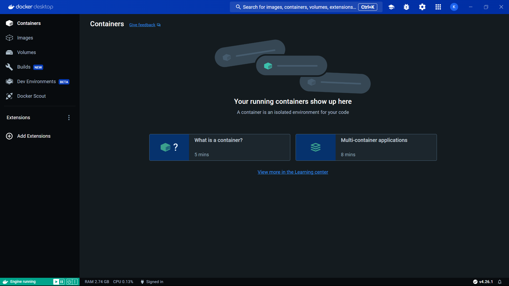
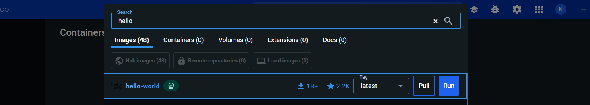
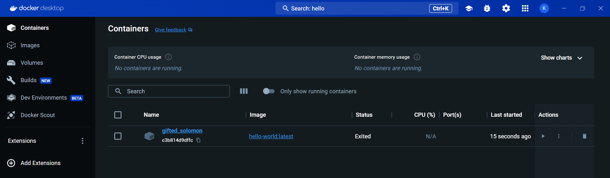
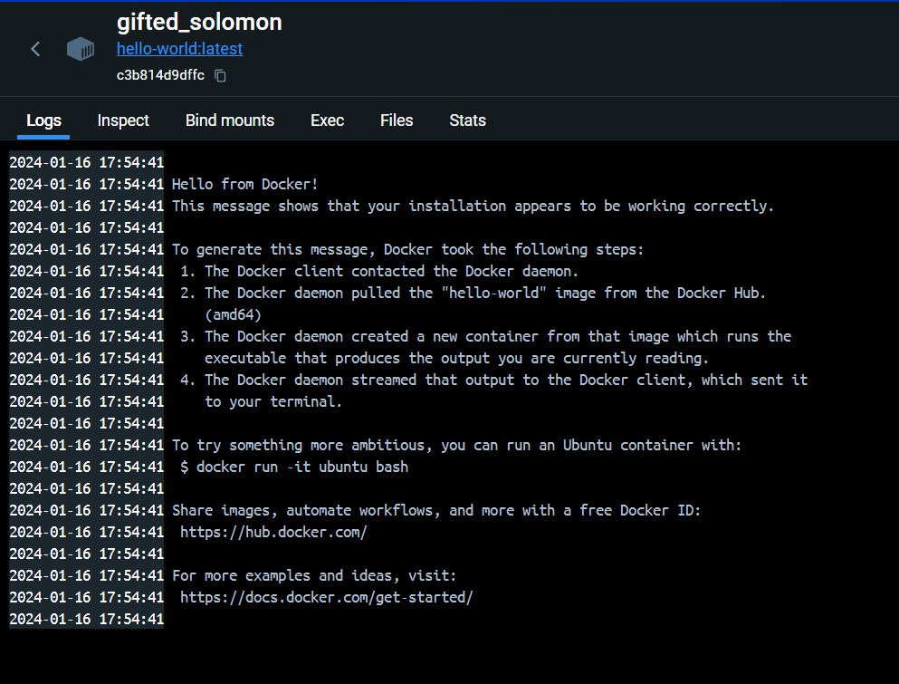
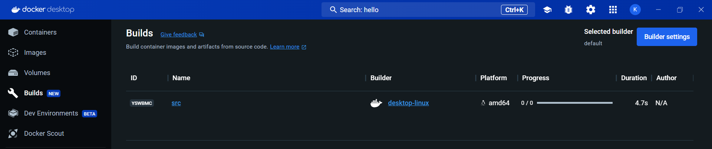
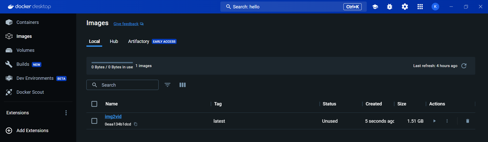
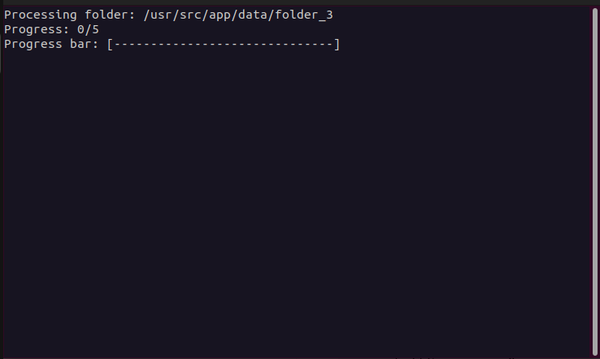

# IMG2VID

IMG2VID est un projet en Python visant à transformer des séquences d'images en vidéo afin d'optimiser l'espace de stockage d'un serveur d'images.

### Contributeurs
- Enora RICHARDEAU
- Leo-Paul HUAR
- Thibault PILON
- Jeremy BINDEL

Encadrés par :
- Paul TEMPLE (tuteur école)
- Jérôme MANCEAU (tuteur industriel)

Ce projet a été réalisé dans le cadre d'un projet industriel au sein de l'ESIR (Université de Rennes) en collaboration avec l'entreprise NeoTec Vision.

## Fonctionnement
La pierre angulaire de ce projet repose sur l'utilisation de `ffmpeg`, qui permet de convertir une séquence d'images en vidéo. Après la conversion des images en vidéo, notre outil supprime les images, entraînant un gain d'espace supérieur à 25 fois la taille originale.
## Fichiers de configuration

Pour utiliser notre projet, il est nécessaire de choisir un fichier de configuration.

### Pourquoi s'embêter avec cela ?

La diversité des technologies employées par notre projet nécessite une gamme étendue de configurations. Chaque fichier de configuration représente une configuration spécifique, permettant de sélectionner facilement celle qui convient le mieux à vos besoins actuels lors de l'exécution du programme. Pour simplifier cette démarche, nous avons préparé 3 fichiers de configuration avec des profils différents, tous disponibles dans le dossier `config_files`.

### Lequel choisir ?

1. **balanced.conf**
   Cette configuration offre un profil équilibré où le temps de compression, la qualité et la taille du fichier sont tous pris en compte.
2. **best_saving.conf**
   Il s'agit du fichier de configuration le plus lent des trois, mais il a le plus grand impact sur la qualité. En revanche, il offre la meilleure compression parmi les trois.
3. **fast.conf**
   Comme son nom l'indique, ce fichier transforme rapidement vos images en vidéos. Cependant, cette configuration ne garantit pas le meilleur taux de compression.

### Tableau récapitulatif

#### Contenu des fichiers de configuration (pour votre information)
|  | Balanced | BestSaving | Fast |
| ---- | ---- | ---- | ---- |
| Encodeur | x264 | x264 | x265 |
| Preset | VerySlow | VerySlow | UltraFast |
| Tune | none | none | none |
| CRF | 15 | 23 | 15 |

#### Performance en fonction de la configuration
|                         | Balanced | BestSaving | Fast   |
| ----------------------- | -------- | ---------- | ------ |
| Score de qualité (≃)    | 98/100   | 95/100     | 98/100 |
| Taux de compression (≃) | 80       | 135        | 45     |
| Vitesse de compression  | Lente    | Lente      | Rapide |

### Ajouter une configuration à l'outil

Un fichier de configuration se compose de 4 options différentes. Pour ajouter un autre profil, créez simplement un nouveau fichier `.conf` dans le dossier `config_files` et renseignez les valeurs des options entre guillemets :
- "LIB" : choix de la librairie de compression / standard (libx264, libx265, ...)
- "PRESET" : choix de la vitesse de compression (ultrafast, medium, veryslow, ...)
- "TUNE" : choix du réglage d'image (laisser none)
- "CRF" : choix de la quantité de dégradation

L'ensemble des options de configuration est disponible ici : [https://trac.ffmpeg.org/wiki/Encode/H.264](https://trac.ffmpeg.org/wiki/Encode/H.264)
Le fichier peut alors être utilisé comme configuration pour la prochaine exécution du programme.
## Installation de Docker

Afin de garantir la compatibilité avec tous les systèmes d'exploitation tels que Debian, Ubuntu, Windows, etc., notre projet doit être utilisé avec Docker.

### Comprendre Docker en 1 minute

Docker utilise un système de couches. Il permet à notre projet de s'exécuter au-dessus de la couche de l'OS, assurant ainsi son indépendance par rapport à ce dernier. Un Dockerfile présent dans le projet spécifie à la couche comment elle doit se comporter. Ce Dockerfile contient toutes les instructions nécessaires pour créer une image Docker, une couche virtuelle qui se positionnera au-dessus de Debian.

### Installer Docker

#### Debian 32 bits

Dans le terminal, exécutez les commandes suivantes :
```bash
sudo apt -y update
sudo apt -y upgrade
sudo apt install -y apparmor
sudo apt install -y docker.io
```

#### Windows

Téléchargez Docker Desktop [ici](https://www.docker.com/products/docker-desktop/) et installez-le. Vous devriez obtenir l'interface suivante :


Vérifiez bien que la notification en bas à gauche affiche `Engine running`.

### Vérifier l'installation de Docker

#### Debian 32 bits

Dans le terminal, exécutez la commande suivante :
```bash
sudo docker run --rm hello-world
```

Cette commande télécharge une image Docker de test et l'exécute dans un conteneur. Si tout s'est bien passé, vous devriez voir un message de confirmation s'afficher.

#### Windows

Dans la barre de recherche en haut, recherchez l'image Docker `hello-world`. Cliquez ensuite sur `Pull`.


Ensuite, allez dans l'onglet `Images`, l'image `hello-world` devrait apparaître.


Cliquez sur la flèche play `run` de `hello-world`. Aucun paramètre optionnel n'est nécessaire, cliquez sur `Run`. Dans l'onglet `Containers`, un nouveau conteneur provenant de l'image `hello-world` devrait apparaître. Ouvrez-le pour vérifier les logs.



Pour supprimer le conteneur, allez dans l'onglet `Containers` et supprimez-le. Vous pouvez ensuite faire de même avec l'image `hello-world` dans l'onglet `Images`.
## Compiler l'image Docker du projet

Pour exécuter le projet, il est nécessaire de compiler son image Docker au préalable. Cette opération doit être effectuée une seule fois avant la première exécution. Cependant, il est important de recompiler l'image Docker si des modifications ont été apportées au code source.

**Attention**, il est nécessaire de recompiler l'image Docker en cas de modifications du code source.

### Debian 32 bits

Dans le terminal, accédez à la racine du projet et déplacez-vous dans le dossier `src` :
```bash
cd chemin/vers/le/projet/git
cd src
ls
# Le fichier Dockerfile doit apparaître
```

Ensuite, lancez la compilation de l'image :
```shell
# N'oubliez pas de mettre le point à la fin de la commande
sudo docker build -t img2vid:latest .
```

**Note** : La compilation peut prendre du temps (5-10 minutes en fonction de la machine). Une fois la compilation terminée, vous pouvez retrouver l'image avec la commande :
```shell
sudo docker images
# L'image img2vid devrait apparaître
```

### Windows

Dans le terminal, accédez à la racine du projet et déplacez-vous dans le dossier `src` :
```shell
cd chemin\vers\leprojet\git
cd src
dir
# Le fichier Dockerfile doit apparaître
```

Ensuite, lancez la compilation de l'image :
```shell
# N'oubliez pas de mettre le point à la fin de la commande
docker build -t img2vid:latest .
```

Dans Docker Desktop, dans l'onglet `Build`, la compilation de l'image devrait apparaître.


**Note** : La compilation peut prendre du temps (5-10 minutes en fonction de la machine). Une fois la compilation terminée, l'image peut être retrouvée dans l'onglet `Images`.

## Exécution du programme

### Lancement

#### Debian 32 bits

Maintenant que l'image est compilée, vous pouvez exécuter le programme. Pour faciliter l'exécution, nous allons sauvegarder quelques variables. Revenez à la racine du projet et exécutez les commandes suivantes :
```shell
cd config_files
CONFIG_FOLDER=$(pwd)
# Spécifiez le fichier de configuration à utiliser
CONFIG=balanced
```

Positionnez-vous dans le dossier racine contenant les séquences d'images.
```bash
cd dossier/contenant/lessequences/dimages
IMAGE_FOLDER=$(pwd)
```

Lancez le programme avec la commande suivante :
```bash
sudo docker run --rm -itd --mount src="$IMAGE_FOLDER",target=/usr/src/app/data,type=bind --mount src="$CONFIG_FOLDER",target=/usr/src/app/config_files,type=bind -e config="$CONFIG" -e delete="-r" --name img2vid img2vid:latest
```

La console affiche alors l'ID du conteneur exécutant le programme.

#### Windows

Maintenant que l'image est compilée, vous pouvez exécuter le programme. Pour faciliter l'exécution, nous allons sauvegarder quelques variables. Revenez à la racine du projet et exécutez les commandes suivantes :
```shell
cd config_files
set "CONFIG_FOLDER=%CD%"
# Spécifiez le fichier de configuration à utiliser
set "CONFIG=balanced"
```

Positionnez-vous dans le dossier racine contenant les séquences d'images.
```shell
cd dossier/contenant/lessequences/dimages
set "IMAGE_FOLDER=%CD%"
```

Lancez le programme avec la commande suivante :
```bash
docker run --rm -itd --mount src="%IMAGE_FOLDER%",target=/usr/src/app/data,type=bind --mount src="%CONFIG_FOLDER%",target=/usr/src/app/config_files,type=bind -e config="%CONFIG%" -e delete="-r" --name img2vid img2vid:latest
```

La console affiche alors l'ID du conteneur exécutant le programme. Vous pouvez également retrouver cet ID sur Docker Desktop dans l'onglet `Containers`.

### Déroulement

Pour afficher le statut, exécutez la commande suivante :
```Shell
docker attach img2vid
```

Si l'exécution se passe correctement, vous devriez obtenir la sortie suivante, modulo le chemin du fichier et le nombre de dossiers :


**Note** : `Processing folder` indique la localisation du dossier dans l'image Docker et non sur le serveur. Pour retrouver l'emplacement réel, remplacez `/usr/src/app/data/` par le dossier contenant l'ensemble des images `IMAGE_FOLDER`.

### Logging

Pour chaque séquence d'images compressée, le programme génère un fichier log avec les vidéos. Dans le dossier contenant l'ensemble des images `IMAGE_FOLDER`, on peut également retrouver un fichier log sur tous les dossiers compressés.

